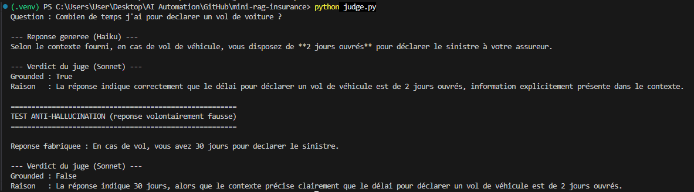
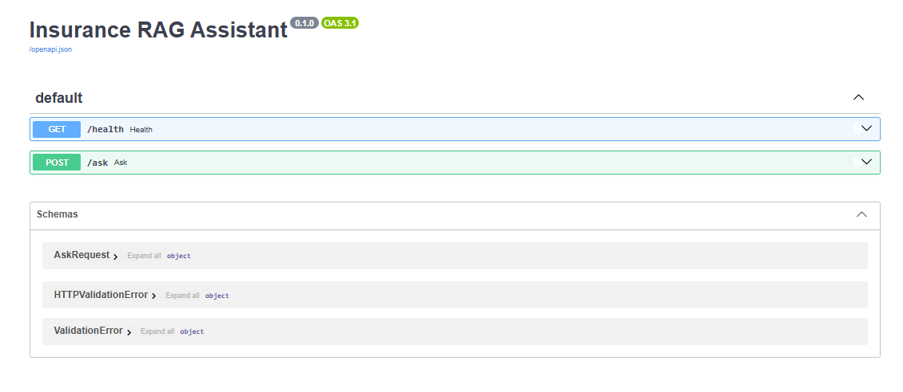
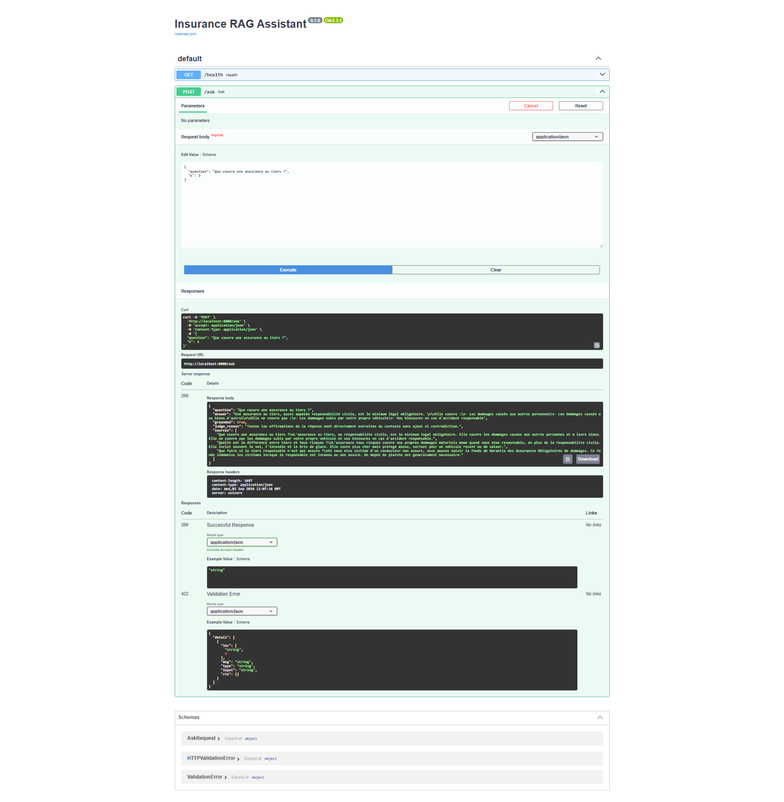
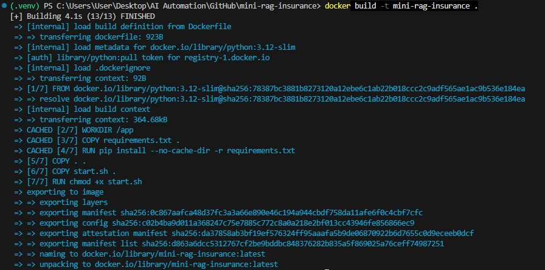
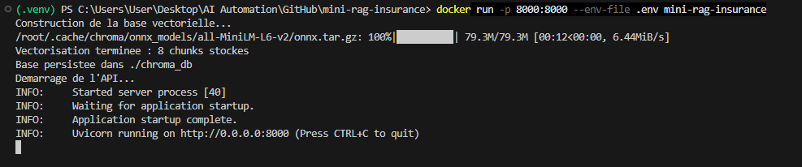

# Insurance RAG Assistant

A retrieval-augmented generation pipeline over a French car-insurance FAQ, built with the Claude API and a two-model validation step. Ask a question in natural language, get an answer grounded in the source documents, and get a second model's verdict on whether that answer is actually supported by the sources.

This is a portfolio project. It runs locally and is packaged to be deployable, not hosted as a live public service. The design choices below are the point of the project, not the size of the corpus.

## Why this project

I come from a systems integration background, including a year on Guidewire ClaimCenter at a large French insurer where I worked on broker EDI flows and claim automation. When I moved toward AI integration, I wanted a RAG project anchored in a domain I actually know rather than a generic demo.

Insurance FAQ is a good fit for RAG. The questions users ask ("what do I do after an accident", "how long to report a theft") rarely match the exact wording of the source text, so keyword search falls short and semantic retrieval earns its place. And in insurance, a wrong answer about a deadline or a coverage has real consequences, which is why I added a validation layer instead of trusting the first generated answer.

## Architecture

The pipeline has two distinct phases that communicate through the vector store on disk.

Indexing (run once):

```text
faq_assurance.txt  ->  chunk by section  ->  local embeddings  ->  ChromaDB (./chroma_db)
```

Querying (per question):

```text
question  ->  embed  ->  retrieve top-k chunks  ->  Haiku generates  ->  Sonnet judges  ->  answer + verdict + sources
```

The two-model validation is the core of the project. Claude Haiku generates the answer from the retrieved context, then Claude Sonnet checks whether every claim in that answer is actually supported by the sources. If the answer drifts from the context, the judge flags it.



The screenshot shows both cases. A correct answer ("2 business days" for a theft, which is in the source) is marked grounded. A fabricated answer ("30 days", which contradicts the source) is rejected with a reason. The guardrail works in both directions, which is what makes it worth having.

## Key technical decisions

**Semantic chunking over fixed-size chunking.** The FAQ has a natural structure where each question-and-answer block is a self-contained unit of meaning, so I split on sections rather than on a fixed character count. A blind fixed-size split would have cut answers in half and produced incoherent chunks, degrading retrieval. Fixed-size chunking with overlap is the right default when a document has no clear structure, but here the structure was there to use.

**Local embeddings, Claude for reasoning.** Embeddings are generated locally by ChromaDB's built-in model, which is free and adds no external dependency or per-token cost for indexing. Claude is reserved for generation and judging, where its reasoning quality actually adds value. Anthropic does not offer an embedding API, so this separation was also the natural choice.

**Model allocation in the judge.** Haiku does the generation (fast, cheap, high volume) and Sonnet does the validation (more capable, used only where judgment matters). Using the smaller model for volume and the larger model for quality control is a deliberate cost-versus-quality decision, not an accident. Running the largest model everywhere would be economically pointless at scale.

**Grounding and hallucination testing.** The generation prompt instructs the model to answer only from the retrieved context and to say it does not know when the context is insufficient. I did not stop at grounding the prompt though. I added a test that feeds the judge a deliberately false answer to confirm it gets rejected, because a judge that always says yes is worthless.

**Retrieving three chunks.** For a small FAQ, k=3 covers the relevant answer plus a little neighbouring context without drowning the model in noise. It is a tuned default, not a magic number.

## API

The pipeline is exposed through a FastAPI service with request validation via Pydantic and auto-generated OpenAPI documentation.

- `POST /ask` takes a question and returns the answer, the judge's verdict, the reason, and the source chunks used.
- `GET /health` is a health check for orchestration.





Returning the sources alongside the answer is part of the contract. Traceability matters in an insurance context: you want to know where an answer came from.

## Running the project

### Locally

```powershell
python -m venv .venv
.\.venv\Scripts\Activate.ps1
pip install -r requirements.txt
```

Create a `.env` file with your Anthropic API key:

```text
ANTHROPIC_API_KEY=your_key_here
```

Build the vector store, then start the API:

```powershell
python vectorize.py
uvicorn api:app --reload
```

The API is then available at `http://localhost:8000`, with interactive docs at `http://localhost:8000/docs`.

### With Docker

The image bundles the code, dependencies and startup logic. The vector store is rebuilt when the container starts, so the container is self-contained.

```powershell
docker build -t insurance-rag-assistant .
docker run -p 8000:8000 --env-file .env insurance-rag-assistant
```





The build and run screenshots confirm the container starts, builds the vector store and serves the API on port 8000. The API keys are never baked into the image. They are passed at runtime with `--env-file`, and the `.env` file is git-ignored.

## Production considerations

This project runs locally by design. Taking it to production would mainly involve how the vector store is hosted.

The current setup rebuilds the ChromaDB store on container start, which is fine for a self-contained demo but wasteful for a real deployment. In production I would either mount a persistent Docker volume so the store survives restarts, or move to ChromaDB in server mode or a managed vector service. The embedded ChromaDB used here persists to a local directory, which does not fit the ephemeral filesystems of platforms like Railway or Cloudflare Workers, so a persistent volume or a managed store is the real path forward.

Beyond storage, a production version would add rate limiting, structured logging, and retrieval reranking for larger corpora.

## Tech stack

- Python
- Claude API (Haiku for generation, Sonnet for validation)
- ChromaDB (local embeddings and vector store)
- FastAPI and uvicorn
- Docker

## Project structure

```text
insurance-rag-assistant/
  faq_assurance.txt      corpus (French car-insurance FAQ)
  ingest.py              load and chunk the document
  vectorize.py           build the ChromaDB vector store
  retrieve.py            semantic retrieval
  generate.py            RAG generation with Haiku
  judge.py               LLM-as-judge validation with Sonnet
  api.py                 FastAPI service
  start.sh               container startup (build store, then serve)
  Dockerfile
  requirements.txt
```

## Author

Youssef Mokhbi — [github.com/youssefmkb](https://github.com/youssefmkb) · [LinkedIn](https://linkedin.com/in/youssef-mokhbi-654a9b10a)
